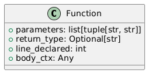
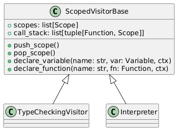

# 🧠 Interpreter Architecture (Implementation Overview)

This document describes the structure and implementation of the NetLang interpreter.

---

## 🧾 Overview

The NetLang interpreter is implemented in **Python** and designed as a **two-pass execution engine** using the ANTLR4 parser generator.

### 🔁 Two-pass design:
1. **TypeCheckingVisitor** – validates variable declarations, type safety, expressions, and function calls.
2. **Interpreter** – executes the code after type checking has passed successfully.

Both visitors implement traversal over the AST (Abstract Syntax Tree) produced from the grammar defined in [`NetLang.g4`](../NetLang.g4).

---

## Scope and Activation Record System in NetLang

In the NetLang interpreter, the scoping system and activation records are implemented using several key classes. The following UML diagrams illustrate the most important data structures used to manage variable/function scopes and function call stack tracking.

---

### `Variable` Class


Represents a variable in the current scope.

- `type`: The declared type of the variable (e.g., `"int"`).
- `line_declared`: The line number where this variable was declared, used for error messages.
- `value`: The current runtime value of the variable (interpreter only).

---

### `Function` Class



Represents a user-defined function.

- `parameters`: A list of parameter names and their types.
- `return_type`: The declared return type, or `None` for void.
- `line_declared`: The line where the function is defined.
- `body_ctx`: The ANTLR context (parse tree node) for the function body.

---

### `Scope` Class


Represents a single scope frame. Each scope knows its parent.

- `variables`: Dictionary mapping variable names to `Variable` objects.
- `functions`: Dictionary mapping function names to `Function` objects.
- `parent`: Reference to the parent scope (or `None` if this is the global scope).

---

### `ScopedVisitorBase` and Call Stack



A base class used by both the type checker and interpreter. It manages:

- `scopes`: A list of currently active `Scope` objects (acting like a stack).
- `call_stack`: A list of tuples `(function_name, scope)` used to track dynamic call relationships.

This system allows us to model:
- Dynamic function calls (including recursion),
- Scoped variables with proper resolution using the `parent` chain,
- Nested scopes via blocks (`{}`), loops, and functions.

---

_The next section describes how these components work together to simulate a stack-based execution model with lexical scoping and dynamic activation frames._

---

## Scope Stack and Activation Records

In NetLang, scopes are implemented through a stack-like structure and managed using the `ScopedVisitorBase` class. Each `Scope` object contains a dictionary of `variables` and `functions`, along with a reference to its `parent` scope.

### Scope Push and Pop

The interpreter uses `push_scope()` and `pop_scope()` to control scope activation:

```python
def push_scope(self):
    new_scope = Scope(parent=self.scopes[-1])
    self.scopes.append(new_scope)

def pop_scope(self):
    self.scopes.pop()
```

When a new scope is created, it is appended to the `self.scopes` list and initially inherits the previous scope as its parent. Depending on the context (e.g., function calls), the parent reference might be updated immediately after creation.  A new scope can be created with curly braces: { ... }, if block body, loop body or function body.

### Function Call Handling and Recursion

Function calls may either use the current dynamic scope or a statically captured one. To distinguish between recursive and non-recursive calls, we use:

```python
is_recursive = self.call_stack and self.call_stack[-1][0] is function
parent_scope = self.call_stack[-1][1].parent if is_recursive else self.scopes[-1]
```

- If the current function is recursive, the parent is not the most recent scope but the original parent used in the first invocation (stored on the call stack).
- The new scope is pushed and updated as follows:

```python
self.push_scope()
self.scopes[-1].parent = parent_scope
```

Next, we declare the function parameters insdie that scope. Then, an entry is added to the call stack and the function body is executed:
```python
self.call_stack.append((function, self.scopes[-1]))
self.visit(function.body_ctx)
```

After executing the body, we remove the corresponding scope and call stack entry:
```python
self.pop_scope()
self.call_stack.pop()
```

### Scoped Identifier Resolution

To resolve scoped identifiers like `^x` or `~x`, we recursively walk through the parent scopes:

```python
if prefix.startswith("^"):
    levels_up = len(prefix)
    for _ in range(levels_up):
        scope = scope.parent
elif prefix == "~":
    while scope.parent is not None:
        scope = scope.parent
```

After resolving the reference point, the interpreter searches for a matching variable or function in that scope chain:

```python
while s:
    if var_name in s.variables or var_name in s.functions:
        return s, var_name
    s = s.parent
```

This mechanism ensures correct visibility and isolation of variables depending on their declaration scope and how the function was invoked (static vs dynamic context).

---

## 📁 Project Structure

### `main.py`
Entry point script for launching the interpreter from the command line:
```bash
python3 main.py program.netlang
```
This script initializes the ANTLR parser, runs type checking, and executes the program using the interpreter.

### `/interpreter/` – Execution logic (main visitor)

| File             | Description                                                                                                           |
|------------------|-----------------------------------------------------------------------------------------------------------------------|
| `interpreter.py` | Entry point for executing NetLang programs. Implements `visitProgram`, `visitPrintStatement`, and statement dispatch. |
| `flowcontrol.py` | Implements loops (`repeat`, `while`, `each`) and `if` statements.                                                     |
| `functions.py`   | Handles function definitions, return statements, and calling functions.                                               |
| `variables.py`   | Manages variable declaration, assignment, and scope resolution.                                                       |
| `fields.py`      | Processes field access and indexed access like `host.ports<0>.ip`.                                                    |
| `packets.py`     | Contains logic for building and forwarding network packets.                                                           |
| `devices.py`     | Handles `connect` and device-specific routing behavior.                                                               |
| `lists.py`       | Implements list operations: `add`, `delete`, list literals.                                                           |
| `operators.py`   | Processes all binary/unary operations and casting logic.                                                              |
| `expressions.py` | Central handling of expression nodes and evaluation.                                                                  |
| `utils.py`       | Shared utility functions used in interpreter execution.                                                               |

---

### `/typechecker/` – Type-checking visitor logic

| File                                                                 | Description                                                                                               |
|----------------------------------------------------------------------|-----------------------------------------------------------------------------------------------------------|
| `type_checker.py`                                                    | Main class `TypeCheckingVisitor`. Called before execution to validate types.                              |
| Other files (e.g. `flowcontrol.py`, `functions.py`, `devices.py`...) | Mirror the structure of `/interpreter/`. Each file handles the same logic but statically validates types. |
| `utils.py`                                                           | Additional utility functions used only by the `TypeCheckingVisitor`                                       |

---

### `/shared/model/` – Core domain models

| File                                                         | Description                                       |
|--------------------------------------------------------------|---------------------------------------------------|
| `Host.py`, `Switch.py`, `Router.py`, `Device.py`             | Represent network devices.                        |
| `Port.py`, `CopperEthernetPort.py`, `OpticalEthernetPort.py` | Represent physical ports.                         |
| `CIDR.py`, `IPAddress.py`, `MACAddress.py`                   | Represent address-related objects and validation. |
| `Packet.py`                                                  | Structure of an IP packet used for delivery.      |
| `RoutingEntry.py`                                            | Object used in routers’ routing tables.           |
| `Connection.py`                                              | Defines physical connections between ports.       |
| `Scope.py`, `Function.py`, `Variable.py`                     | Runtime containers for interpreter state.         |
| `ReturnValue.py`                                             | Signal for returning values from functions.       |
| `base.py`                                                    | Base class for typed objects.                     |

---

### `/shared/utils/`

| File         | Description                                          |
|--------------|------------------------------------------------------|
| `types.py`   | Defines subtyping and type compatibility checks.     |
| `errors.py`  | Contains all custom interpreter/runtime/type errors. |
| `scopes.py`  | Stack-based scope resolution logic.                  |
| `logging.py` | Helpers for structured logging and debug output.     |

---

### `/generated/` – Files generated by ANTLR

| File                                      | Description                                                     |
|-------------------------------------------|-----------------------------------------------------------------|
| `NetLangLexer.py`, `NetLangParser.py`     | Lexer/parser generated from `NetLang.g4`.                       |
| `NetLangListener.py`, `NetLangVisitor.py` | Base classes for listener/visitor logic.                        |
| `.tokens`, `.interp` files                | Internal files used for ANTLR interpreter and token management. |

---

### `/programs/` – Program testing system

| Subfolder | Description                                                      |
|-----------|------------------------------------------------------------------|
| `source/` | Contains test `.netlang` programs organized by number.           |
| `output/` | Expected `.txt` outputs for each test, used by `test_runner.py`. |

---

### `/docs/` – Documentation

| File              | Description                                                  |
|-------------------|--------------------------------------------------------------|
| `installation.md` | Instructions for installing and running the interpreter.     |
| `grammar.md`      | Detailed breakdown of grammar rules defined in `NetLang.g4`. |
| `language.md`     | Complete language reference guide.                           |
| `interpreter.md`  | This file – explains the internal interpreter structure.     |
| `examples.md`     | Sample programs with explanations.                           |

---

### `/images/`
Contains icon files (PNG) used in the network visualization module (e.g. `host.png`, `router.png`, `switch.png`, `packet.png`). These icons are rendered using **PyGame** during packet transmission animation.

### `/fonts/`
Contains the `OpenSans-Regular.ttf` font used for rendering labels and messages in the visual simulation window.

### `test_runner.py`
Custom test runner used to verify the correctness of `.netlang` test files.
- Loads test programs from `programs/source/`
- Compares output to `programs/output/`
- Reports pass/fail/missing statuses
- Useful for regression testing and continuous integration

## 🧪 Interpreter Flow Summary

1. The program is parsed using ANTLR (`NetLang.g4`) into a syntax tree.
2. `TypeCheckingVisitor` validates the entire AST.
3. If type checking passes, `Interpreter` executes the AST.
4. Visualization and packet forwarding is rendered using PyGame and NetworkX.

---